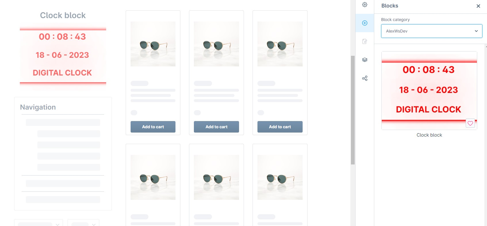
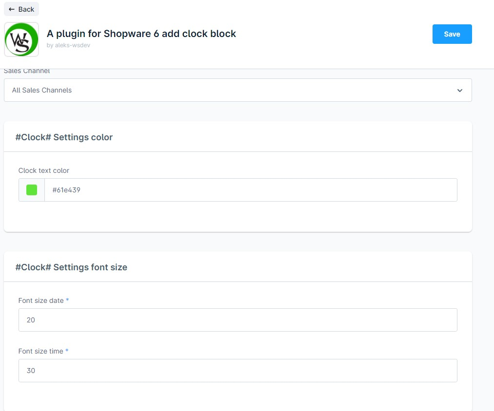

# Digital clock block for Shopware 6


## Installation

Clone this repository into a folder called **Clock** within the **custom/plugins** directory of the Shopware installation.
* open console and run
```
bin/console plugin:refresh  
bin/console plugin:install --activate --clearCache Clock
```

## Screenshots
<div align="center">
  
  
  
  
  
</div>
